<p align="center">

# 🚀 Mates

### A Full-Stack Chat Application built to explore Production-Oriented Backend & DevOps Practices.


</p>

---

## 📖 Overview

**Mates** started as a learning project to explore Django REST Framework through building a real-world chat application.

Instead of stopping after implementing the application itself, the project gradually evolved into a complete platform focused on production-oriented software engineering practices.

The current version demonstrates how a multi-service application can be containerized, monitored, and automatically built using modern DevOps tooling.

---

## 🚀 Project Evolution

### Phase 1 — MVP Application ✅

- JWT Authentication
- Public & Private Rooms
- Join / Leave Room Logic
- Real-time Chat using Django Channels
- Message History
- REST APIs
- React Frontend
- WebSocket Integration

---

### Phase 2 — Infrastructure & DevOps ✅

- Monorepo Structure
- Docker Compose Architecture
- Nginx Reverse Proxy
- Celery Workers
- Redis Broker
- GitHub Actions CI/CD
- Docker Hub Image Publishing
- Prometheus Monitoring
- Grafana Dashboards
- Node Exporter
- cAdvisor
- Nginx Exporter
- Django Prometheus Exporter

---

### Phase 3 — Coming Soon ☕

- Kubernetes
- AWS
- GitOps
- Terraform
- Production Deployment

---

# 🏗 Architecture

The application is organized as independent services communicating through Docker networks.

Each backend service owns its own database while Redis is shared between Celery workers.

Prometheus continuously scrapes infrastructure and application metrics while Grafana provides monitoring dashboards.

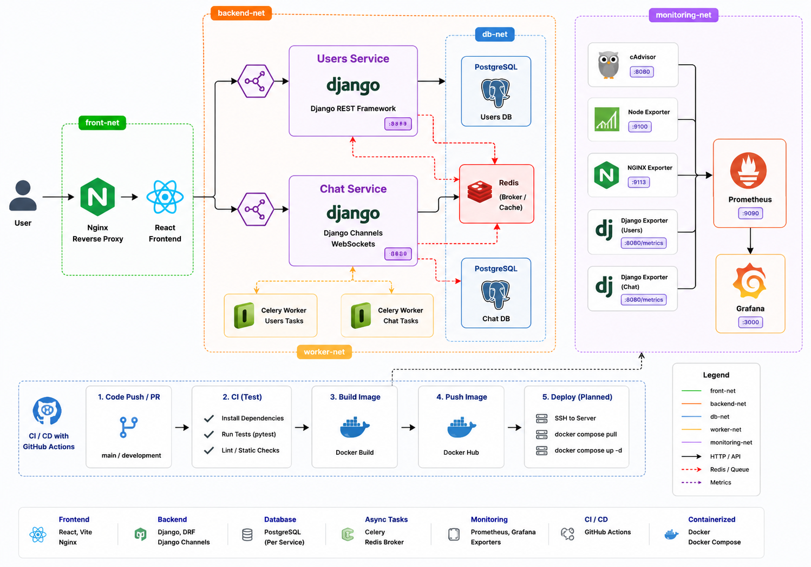

---

# ⚙ Tech Stack

| Layer | Technologies |
|---------|--------------|
| Frontend | React, Vite |
| Backend | Django, Django REST Framework |
| Realtime | Django Channels, WebSockets |
| Background Jobs | Celery |
| Message Broker | Redis |
| Database | PostgreSQL |
| Reverse Proxy | Nginx |
| Containers | Docker, Docker Compose |
| Monitoring | Prometheus, Grafana |
| Exporters | cAdvisor, Node Exporter, Nginx Exporter, Django Prometheus |
| CI/CD | GitHub Actions |
| Image Registry | Docker Hub |

---

# 📁 Project Structure

```text
.
├── backend/
├── frontend/
├── docker/
├── monitoring/
├── k8s/
└── .github/
```

The repository was migrated into a monorepo to simplify development and deployment while keeping infrastructure alongside the application source code.

---

# 🧩 Services

## Frontend

- React
- Vite
- Nginx

---

## Users Service

Responsible for

- Authentication
- Registration
- User Profiles
- JWT

---

## Chat Service

Responsible for

- Rooms
- Messages
- Join Requests
- WebSockets

---

## Celery

Background workers for asynchronous tasks.

---

## Redis

Shared message broker for Celery.

---

## PostgreSQL

Each backend service owns its own isolated PostgreSQL instance.

---

# 📊 Monitoring Stack

The monitoring stack collects both infrastructure metrics and application-level metrics.

```
Node Exporter
        │
cAdvisor
        │
Nginx Exporter
        │
Django Prometheus Exporters
        │
   Prometheus
        │
    Grafana
```

---

## Infrastructure Monitoring

- CPU Usage
- Memory Usage
- Network Usage
- Disk Metrics
- Container Metrics

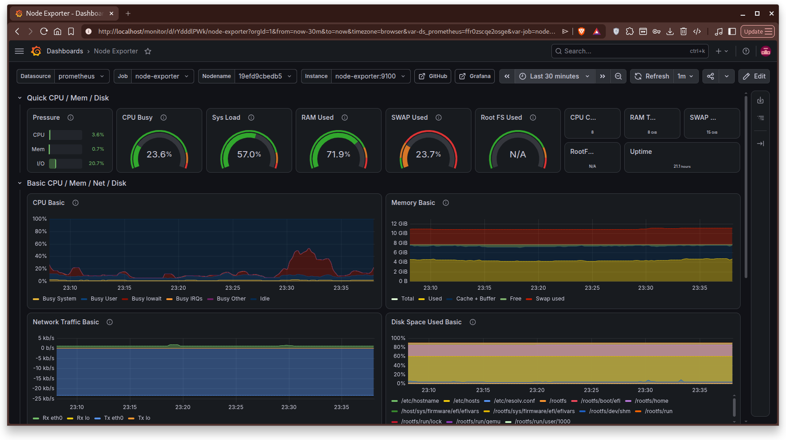

```
assets/node-dashboard.png
```

---

## Container Monitoring

Metrics collected through **cAdvisor**

- CPU
- RAM
- Network
- File System

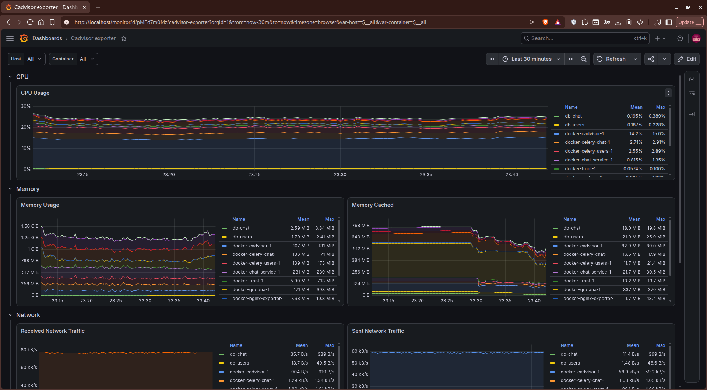

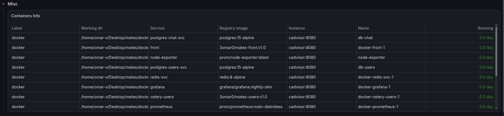

```
assets/cadvisor-dashboard.png
```

---

## Nginx Monitoring

Collected using Nginx Prometheus Exporter.

Metrics include

- Active Connections
- Reading
- Writing
- Waiting
- Accepted Connections

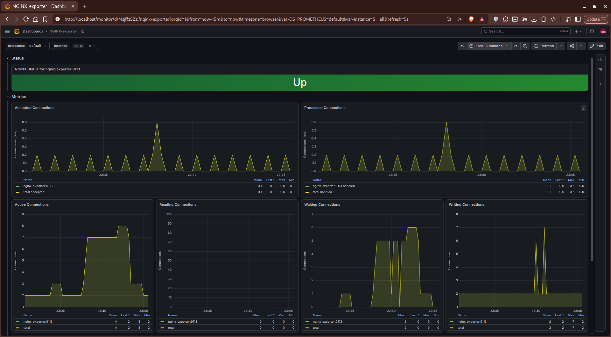

```
assets/nginx-dashboard.png
```

---

## Application Monitoring

Collected through django-prometheus.

Metrics include

- HTTP Requests
- Response Codes
- Request Latency
- Database Operations

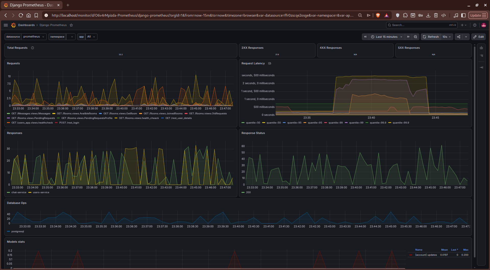

```
assets/django-dashboard.png
```

---

# 🔄 CI / CD

The project currently contains **5 GitHub Actions workflows**.

| Workflow | Purpose |
|------------|----------|
| users-ci | Install dependencies and run pytest |
| users-cd | Build Docker image and publish to Docker Hub |
| chat-ci | Install dependencies and run pytest |
| chat-cd | Build Docker image and publish to Docker Hub |
| front-cd | Build frontend image and publish to Docker Hub |

Deployment through SSH is already prepared inside the workflows and can be enabled once a stable production server is available.

---

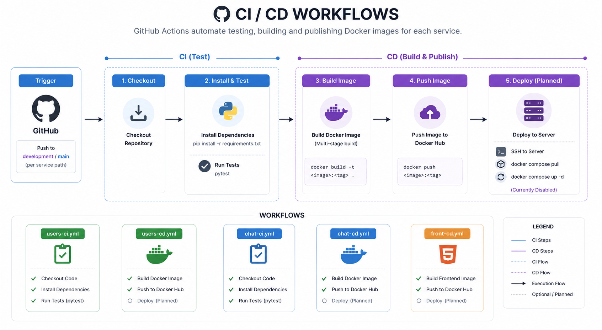

```
assets/github-actions.png
```

---

# 🌐 Main APIs

## Users

| Endpoint | Description |
|------------|------------|
| POST /auth/registration | Register |
| POST /auth/login | Login |
| GET /auth/user | Current User |
| GET /profile/{id} | User Profile |

---

## Rooms

| Endpoint | Description |
|------------|------------|
| GET /api/rooms | List Rooms |
| POST /api/rooms/create | Create Room |
| POST /api/rooms/join | Join Room |
| POST /api/rooms/leave | Leave Room |

---

## WebSocket

```
ws://host/ws/chat/<room_id>/
```

---

# 🖼 Application Screenshots

## Login

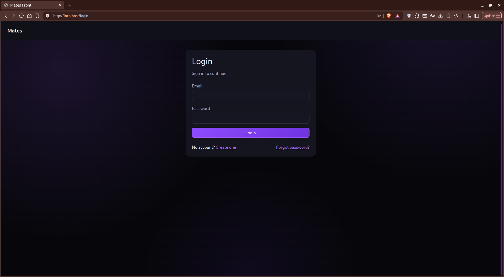

```
assets/login.png
```

---

## Rooms

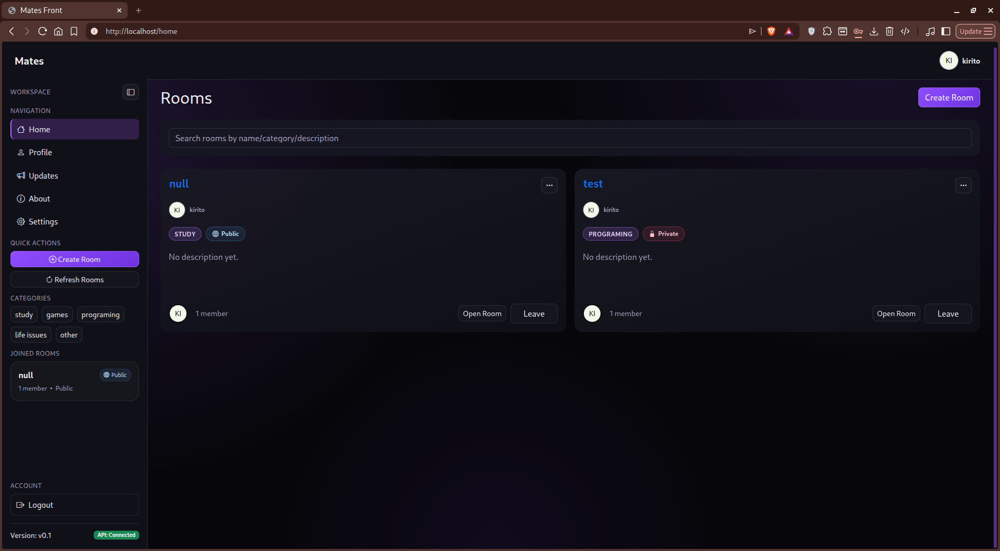

```
assets/rooms.png
```

---

## Chat

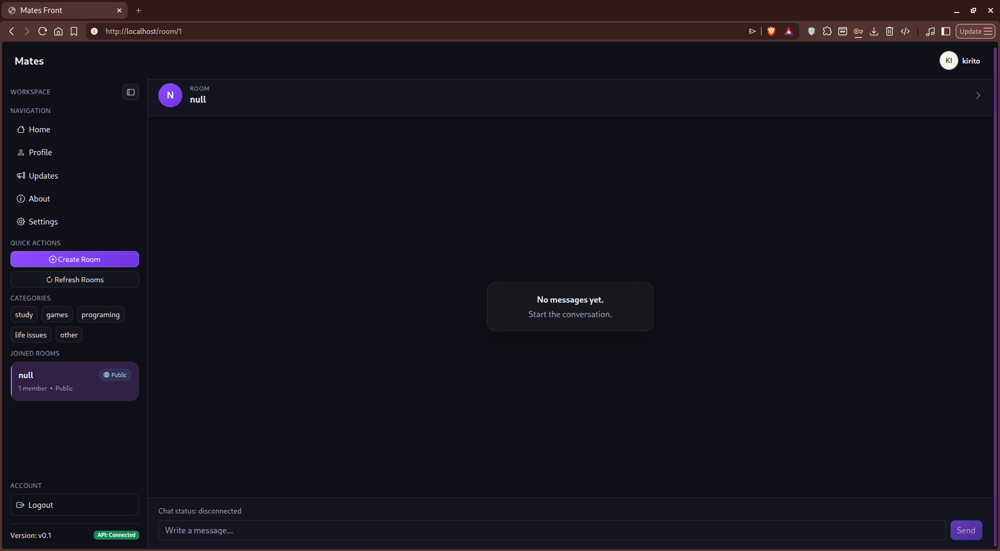

```
assets/chat.png
```

---

## Profile

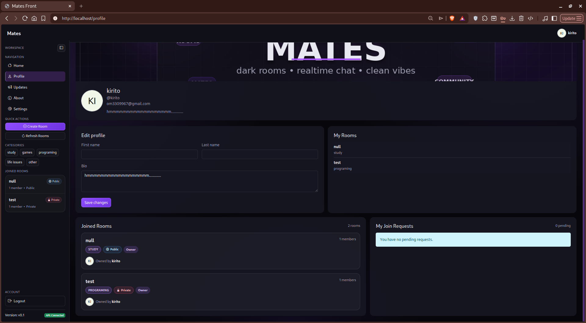

```
assets/profile.png
```

---

# 🐳 Running Locally

```bash
git clone https://github.com/<username>/mates.git

cd mates/docker

docker compose up --build
```

---

# 🛣 Roadmap

- [x] MVP Chat Application
- [x] Docker Compose
- [x] Reverse Proxy
- [x] Monitoring Stack
- [x] CI/CD Pipelines
- [ ] Kubernetes Migration
- [ ] AWS Deployment
- [ ] GitOps
- [ ] Terraform

---

# 👨‍💻 Author

**Omar**

Computer Science Student interested in Backend, DevOps and Platform Engineering.

---

If you found the project interesting, feel free to leave a ⭐ on the repository.